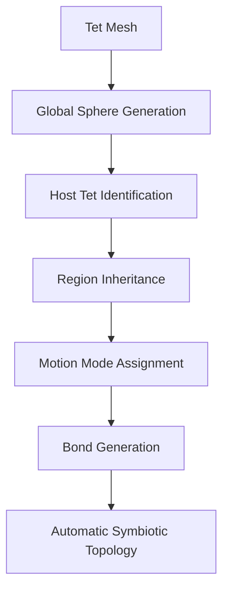

# CONCEPT MODEL — Automatic Symbiotic Topology Construction

**Freeze ID:** ConceptModel_v0.1  
**Release:** Prototype_v0.1  
**Date:** 2026-07-13  

This figure is frozen for thesis Chapter 3, slides, and future notes. Do not redraw a competing “main” pipeline without ADR update.

## Canonical Pipeline

```
Tet Mesh
   │
   ▼
Global Sphere Generation
   │
   ▼
Host Tet Identification
   │
   ▼
Region Inheritance
   │
   ▼
Motion Mode Assignment
   │
   ▼
Bond Generation
   │
   ▼
Automatic Symbiotic Topology
```

## Mermaid (same content)



## Reading Guide

| Step | Meaning |
|------|---------|
| Tet Mesh | Input continuum discretization (FEM regions carry `tet_region`) |
| Global Sphere Generation | Spheres fill the whole computational domain |
| Host Tet Identification | Point-in-tet + barycentric `N1..N4` |
| Region Inheritance | Sphere region inherited from host tet (or DEM if no host) |
| Motion Mode Assignment | `MOTION_PROXY` / `MOTION_FREE` from inherited region |
| Bond Generation | Distance-based bonds; Proxy–Free bonds appear at interfaces |
| Automatic Symbiotic Topology | Ready coupling graph without manual Proxy/Free labeling |

## Non-goals of this figure

This figure does **not** include Cell Linked List, fracture, contact, wave propagation, or beam loading. Those belong to later phases.
