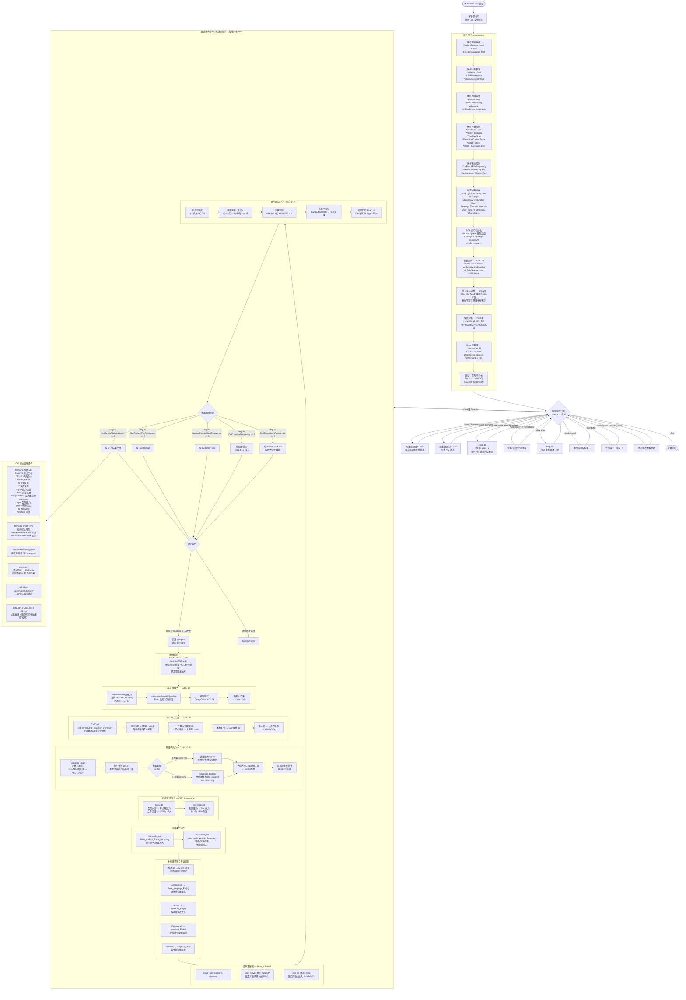

# MultiFracS v5.8 调用流程图

> 来源：`User_solver/` 源码 + `inp数据格式文件5.8.md` + DLL接口分析（逆向推断主程序逻辑）
> 注意：MultiFracS.exe 为闭源程序，本图为基于接口规范和文档的重建。

---

## 一、整体工作流（外部视角）

```
gmsh
  └─ 建几何 → 划分物理组 → 划分网格 → 导出 .inp
        ↓
  手动在 .inp 末尾添加：
    *Material *Joint *FixBoundary *SForceBoundary *VBoundary
    *CalulationType *TimeStepSize *Begin *solve *End
        ↓
  将 .inp 拖入 MultiFracS.exe（或命令行传参）
        ↓
  MultiFracS.exe 求解
        ↓
  输出：.vtk .csv .sav .dat
        ↓
  ParaView 后处理
```

---

## 二、主调用流程图（Mermaid）



---

## 三、数据结构流（SOA 布局）

```
CPUCORE 结构体（传递给 User_solver.dll）
│
├── FEM 节点信息
│   ├── nfn          : FEM 节点总数
│   ├── d1fnix[nfn]  : 初始 X 坐标 (SOA)
│   ├── d1fniy[nfn]  : 初始 Y 坐标
│   └── d1fniz[nfn]  : 初始 Z 坐标
│
├── 离散节点信息（FEM+DEM 统一编号）
│   ├── ndn           : 节点总数
│   ├── d1dncx[ndn]   : 当前 X 坐标
│   ├── d1dnvy[ndn]   : Y 方向速度
│   ├── d1dnmass[ndn] : 节点质量
│   └── d1dnfx[ndn]   : X 方向节点力（各模块汇集）
│
├── 实体单元信息
│   ├── ndsolidelem      : 实体单元数
│   ├── i1enid[ne*(3+1)] : 单元-节点映射 (3D 四面体 4节点)
│   └── i1ebeflag[ne]    : 边界单元标志
│
└── 节理单元信息
    ├── njelem        : 节理单元数
    ├── i1jenid[nj*6] : 节理单元节点映射 (3D 三角节理 6节点)
    └── i1jebk[nj]    : 节理断裂状态 (<=0 完整 / >0 断裂类型)
```

---

## 四、DLL 调用时序（单时间步内）

```
每步调用顺序（近似）：

nstep++
  ├─① Cd3D.dll        (DEM 接触力)
  ├─② Ce3D.dll        (FEM 单元内力)  ← 调用 Ce3D_Tet_constitutive_equation_increment
  │    └─ Mech.dll    (弹模/渗透率随应力更新)
  ├─③ Cjoint3D.dll   (节理单元力)   ← 调用 Cjoint3D_intact / Cjoint3D_broken
  ├─④ Cf3D.dll        (裂缝流体压力)
  ├─⑤ cseepage.dll   (孔隙压力 Biot 体力)
  ├─⑥ SBoundary.dll  (面力边界)
  ├─⑦ VBoundary.dll  (速度边界 + 地震波)
  ├─⑧ Seepage/Thermal/Moisture.dll (多场参数更新)
  ├─⑨ User_solver.dll → solve_user → user_solver → user_to_MultiFracS
  └─⑩ 显式积分 (主程序内核) → x(t+dt) v(t+dt/2)

  if (nstep % outvtk == 0):
    └─ 写 VTK  ← Output_vtk_user (用户扩展) + 主程序内建 VTK writer
```

---

## 五、论文开发定位

### InterfaceBond 将介入的位置（第③步）

```
nstep 循环中，第③步节理单元力计算：

现有：Cjoint3D.dll
  └─ Cjoint3D_intact(rs, vnor, area, h, pn, ps, co, fric, ft, gi, gii,
                      imat, ijesf, ijebk, damge, d1jefs, p1,p2,p3, fnt)

新增（论文目标）：InterfaceBond.dll 或扩展 Cjoint3D
  └─ InterfaceBond_intact(
       femNodeVel[4][3],    ← FEM 四节点速度
       shapeFuncN[4],       ← 形函数插值系数
       demParticleVel[3],   ← DEM 颗粒速度
       Kn, Kt,              ← 界面法向/切向刚度
       fnt[2][3]            ← 力传递到两侧
     )

调用位置：
  主程序在处理 JEInterfaceBond 类型节理时
  → 调用形函数插值获得 FEM 侧代理颗粒速度
  → 调用 InterfaceBond_intact 计算界面力
  → 将力分别反馈到 FEM 节点和 DEM 颗粒
```

---

*本文件由源码阅读和文档分析自动生成，仅用于论文开发参考，非官方文档。*
